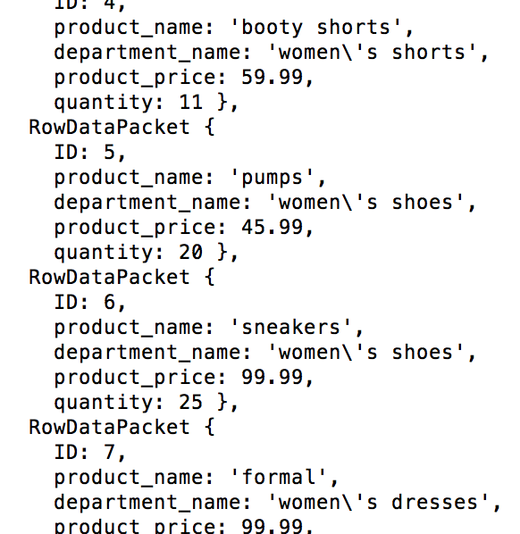

The server is set up to return and update inventory from a mock boutique.

The user is able to view available inventory.
The user is able to select from the available inventory.
The user is able to purchase their desired selection.

The database keeps an accurate account of the boutiques inventory.
The database will return available invenotry by selected product type.
The database will deduct (temporaily) from the inventory count when the user selects their desired product. 
The database will deduct from the inventory count when the user selects their desired product.

Working functionality:

Database contains all inventory count
User can view available inventory
Deduction of inventory on selection